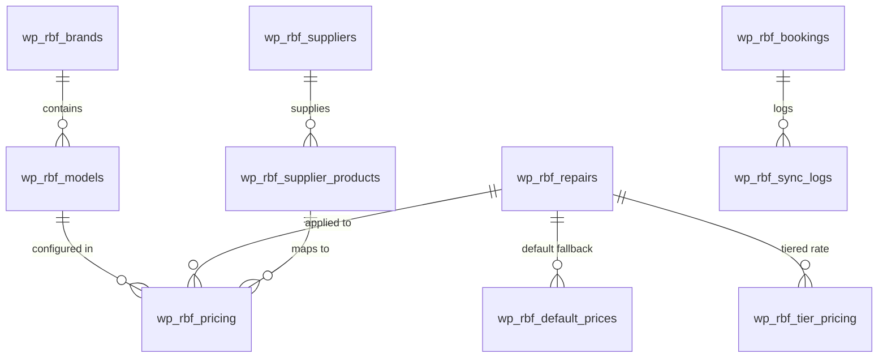
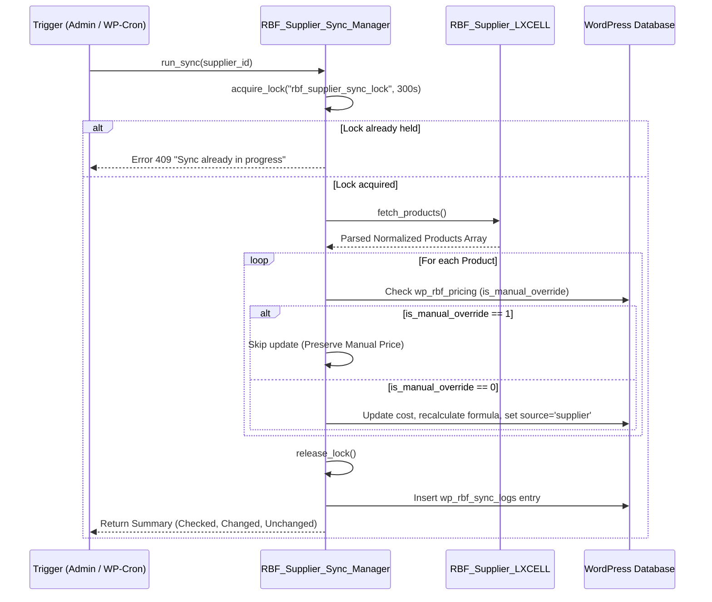

# 🧠 EFIX Repair Booking Plugin — System Brain & Architecture Spec

> **Version:** 2.0.0  
> **Target Environment:** WordPress 6.0+, PHP 8.0+, MySQL 5.7+ / MariaDB 10.3+  
> **Core Principle:** Fail-safe, decoupled, multi-tiered pricing with server-authoritative calculations and zero client price trust.

---

## 1. Architectural Philosophy & Core Axioms

The EFIX Repair Booking Plugin is engineered as an enterprise-grade mobile, tablet, and laptop repair estimation, scheduling, and parts synchronization system. The architecture is guided by six non-negotiable axioms:

1. **Server-Authoritative Pricing (Anti-Fraud)**: The frontend JavaScript layer is strictly a presentation layer. Any price submitted in POST payloads by the client is unconditionally discarded. Totals, VAT (5%), subtotals, and deposit amounts are re-evaluated from the authoritative database engine at the exact moment of order creation.
2. **Deterministic Priority Cascade**: Prices never fail silently or leave a customer with a 0.00 AED price. If a live supplier feed goes out of stock or fails, the pricing cascade seamlessly drops to the model tier, legacy price, or global default without breaking customer checkout.
3. **Manual Override Immutability**: When an administrator sets a specific price for a Device Model + Repair Type, that manual price is permanently locked. No automated supplier sync, wholesale CSV/XLSX import, or bulk operation can overwrite an explicit manual override.
4. **Data Privacy & Wholesaler Secrecy**: Wholesale spare-part costs, labour fees, markup percentages, supplier names (e.g., LXCELL), and wholesaler SKUs are strictly isolated in admin tables. They are filtered and stripped before any AJAX response or frontend view is dispatched.
5. **Zero Heavy Composer Dependencies**: Wholesale XLSX parsing, CSV streaming, and XML parsing use pure native PHP (`ZipArchive` + `SimpleXML`) ensuring the plugin runs in any standard WordPress hosting environment without bloat.
6. **100% Local Asset Self-Hosting**: All device photos (525 models across 18 brands) and logos are hosted locally on disk inside `Brands/` without relying on third-party CDNs or external image hotlinking.

---

## 2. The 6-Level Pricing Priority Cascade

When a customer or administrator requests a price for `(Model ID, Repair ID)`, the `RBF_Pricing::get_repair_price()` engine evaluates the cascade strictly in the following priority order:

```
┌───────────────────────────────────────────────────────────┐
│ 1. Explicit Admin Manual Override                         │
│    (wp_rbf_pricing.is_manual_override = 1)               │
└─────────────────────────────┬─────────────────────────────┘
                              │ [If Not Set / Overridden]
                              ▼
┌───────────────────────────────────────────────────────────┐
│ 2. Verified Live Supplier Price (Fresh & In-Stock)        │
│    Formula: (Supplier Part Cost + Labour) * (1 + Markup%) │
└─────────────────────────────┬─────────────────────────────┘
                              │ [If Out-of-Stock / Unmapped]
                              ▼
┌───────────────────────────────────────────────────────────┐
│ 3. Smart 4-Tier Model Price                               │
│    (Economy / Mid-Range / Flagship / Premium Multipliers) │
└─────────────────────────────┬─────────────────────────────┘
                              │ [If Tier Price Empty]
                              ▼
┌───────────────────────────────────────────────────────────┐
│ 4. Legacy Matrix Base Price                               │
│    (Historical wp_rbf_pricing.price)                      │
└─────────────────────────────┬─────────────────────────────┘
                              │ [If Legacy Matrix Empty]
                              ▼
┌───────────────────────────────────────────────────────────┐
│ 5. Global Default Repair Price                            │
│    (wp_rbf_default_prices table)                          │
└─────────────────────────────┬─────────────────────────────┘
                              │ [If Default Table Empty]
                              ▼
┌───────────────────────────────────────────────────────────┐
│ 6. Master Catalog JSON Baseline                           │
│    (brands_models_data.json master baseline)              │
└───────────────────────────────────────────────────────────┘
```

### The Exact Supplier Pricing Formula
```
Final Customer Price = round( (Supplier Part Cost + Labour Cost) * (1 + Markup % / 100), 2 )
```
* **Supplier Part Cost**: Sourced from the active provider (`wp_rbf_supplier_products.cost_price`).
* **Labour Cost**: Sourced per repair service from `wp_rbf_repairs.labour_cost` (falls back to global setting `rbf_default_labour_cost`, default: **80.00 AED**).
* **Markup Percentage**: Sourced from WordPress options `rbf_global_markup_percent` (default: **13%**).

---

## 3. Database Architecture & Schemas

The plugin manages 10 specialized tables prefixed with WordPress `$wpdb->prefix`:



### Table Breakdown
1. **`wp_rbf_brands`**: Brand master table (ID, Name, Logo URL, Status).
2. **`wp_rbf_models`**: Device model master table (ID, Brand ID, Name, Image URL, Tier ID 1-4, Series).
3. **`wp_rbf_repairs`**: Repair services master table (ID, Name, Icon, Description, Duration, Labour Cost, Status).
4. **`wp_rbf_pricing`**: The core pricing matrix.
   - `model_id` (INT)
   - `repair_id` (INT)
   - `price` (DECIMAL 10,2): The calculated/active customer price.
   - `is_manual_override` (TINYINT 1): 1 = Admin explicitly locked, 0 = Dynamic.
   - `source` (VARCHAR 32): `'manual'`, `'supplier'`, `'tier'`, `'legacy'`.
   - `supplier_cost` (DECIMAL 10,2): Wholesale cost of part.
   - `labour_cost` (DECIMAL 10,2): Labour fee applied.
   - `markup_percent` (DECIMAL 5,2): Markup percentage applied.
   - `admin_edited_by` (BIGINT): User ID of administrator who locked price.
   - `last_synced_at` (DATETIME): Timestamp of last sync.
5. **`wp_rbf_tier_pricing`**: Base rates for the 4 device tiers (`Economy`, `Mid-Range`, `Flagship`, `Premium/Foldable`).
6. **`wp_rbf_default_prices`**: Global fallback price per repair type.
7. **`wp_rbf_suppliers`**: Supplier registry (`LXCELL`, etc.) with endpoint configs, feed URLs, and credentials.
8. **`wp_rbf_supplier_products`**: Ingested parts catalog with SKU, brand, model, repair type, cost price, and stock status.
9. **`wp_rbf_bookings`**: Completed customer bookings with encrypted tokens, status tracking, itemized cart, and VAT calculations.
10. **`wp_rbf_sync_logs`**: Comprehensive audit log recording sync durations, items updated, errors, and review alerts.

---

## 4. Supplier Synchronization Engine & Concurrency Lock

Automated sync runs every 48 hours via WP-Cron (`rbf_supplier_price_sync`) or on-demand via the Admin UI.



### Wholesale File Ingestion (OpenXML XLSX & CSV)
- **OpenXML Engine**: Built inside `RBF_Supplier_LXCELL`. Uses PHP `ZipArchive` to extract `xl/worksheets/sheet1.xml` and resolves string indices from `xl/sharedStrings.xml`.
- **Memory Optimization**: Streams directly without reading huge arrays into memory.
- **Smart Column Detection**: Automatically detects column headers (`SKU`, `Product ID`, `Model`, `Repair`, `Price`, `Cost`, `Stock`).

---

## 5. Security & Isolation Matrix

| Layer | Threat Vector | Mitigation Strategy |
|---|---|---|
| **Checkout Pricing** | Client-side price tampering via DevTools | Server completely re-fetches prices from DB; client total is ignored. |
| **Wholesale Data** | Wholesaler cost/supplier name leak | Stripped from AJAX endpoints (`rbf_get_repairs`, `rbf_get_models`). |
| **Admin Operations** | CSRF attacks on price updates/sync | All endpoints require `check_ajax_referer('rbf_admin_nonce', 'nonce')`. |
| **Permissions** | Privilege escalation | Every admin action checks `current_user_can('manage_options')`. |
| **Direct File Access** | Executing PHP files outside WP | Top of every file includes `if (!defined('ABSPATH')) exit;`. |
| **Log Disclosure** | Public access to debug logs | Stored in `wp-content/uploads/rbf-logs/` with `.htaccess` deny rules. |

---

## 6. Directory Structure Standard

```
repair-booking-form/
├── repair-booking-form.php        # Core plugin entry point & hooks
├── uninstall.php                  # Database cleanup on deletion
├── brands_models_data.json        # 18 brands, 525 models seed catalog
├── README.md                      # Primary project overview & installation
├── admin/                         # Admin dashboard pages & views
│   ├── bookings.php               # Bookings management & invoice printer
│   ├── dashboard.php              # Analytics, metrics, status cards
│   ├── models.php                 # Model catalog CRUD & tier assigner
│   └── repairs.php                # Repair services & labour cost editor
├── assets/                        # Compiled static assets
│   ├── css/                       # Frontend & admin stylesheets
│   └── js/                        # Frontend multi-step wizard logic
├── Brands/                        # 100% self-hosted brand & model imagery
│   ├── ipad_modals/               # iPad Pro, Air, Mini, 10th Gen renders
│   ├── macbook_modals/            # MacBook Pro & MacBook Air renders
│   ├── nothing_modals/            # Nothing & CMF phone photos
│   └── ...                        # Apple, Samsung, Xiaomi, Huawei, etc.
├── docs/                          # Comprehensive technical documentation
│   ├── brain.md                   # System brain & architecture (this file)
│   ├── documentation.md           # Admin & user manual
│   ├── documentation.html         # Interactive HTML documentation
│   ├── developer-guide.md         # Hooks, filters & API reference
│   ├── changelog.md               # Version changelog
│   └── archive/                   # Archived legacy documentation
├── includes/                      # Object-oriented core engine
│   ├── class-rbf-pricing.php      # 6-level pricing cascade engine
│   ├── class-rbf-catalog.php      # Catalog sync, tier heuristics & image normalizer
│   ├── class-rbf-currency.php     # Multi-currency & VAT engine
│   ├── class-rbf-error-logger.php # PSR-compliant debug logging
│   ├── class-rbf-tracker.php      # Live repair status tracker
│   ├── class-rbf-whatsapp.php     # WhatsApp automation engine
│   ├── class-brands-models-manager.php # JSON catalog manager
│   └── suppliers/                 # Wholesaler & spare parts feeds
│       ├── interface-rbf-supplier.php
│       ├── class-rbf-supplier-manager.php
│       ├── class-rbf-supplier-sync-manager.php
│       └── class-rbf-supplier-lxcell.php
├── templates/                     # Frontend templates
│   └── form.php                   # [repair_booking_form] shortcode view
└── tools/                         # CLI & Developer diagnostics
    ├── verify_production_readiness.php
    ├── verify_expanded_catalog.php
    ├── check-syntax.php
    └── debug-plugin.php
```
---

## 11. Frontend Multi-Step Wizard & Isolated Receipt Print Architecture

### 11.1 Step 3: 4-Column Square Box Card Grid
The repair selection interface operates as an adaptive responsive grid:
- **Desktop (>1200px)**: `grid-template-columns: repeat(4, 1fr)` with 16px gap.
- **Tablet (901px - 1200px)**: `grid-template-columns: repeat(3, 1fr)`.
- **Mobile (<=650px)**: `grid-template-columns: repeat(2, 1fr)`.

#### Card Component Architecture (`.rbf-repair-item`)
1. **Absolute Checkbox** (`.rbf-repair-checkbox`): Positioned top-right (10px, 10px). Displays vibrant green checkmark (`✓`) when active.
2. **Centered Icon** (`.rbf-repair-icon`): 60x60px rounded container. Renders `` normalized via `renderRepairIconHtml` in JavaScript and `normalize_repair_icon()` in PHP.
3. **Information Container** (`.rbf-repair-info`): Bold clamped title (max 2 lines) and OEM description.
4. **Footer Section** (`.rbf-repair-footer`): Features turnaround time badge (`⏱️ 01-02 Hours`) and bold green price badge.

### 11.2 Step 4: High-Legibility Form Inputs
To avoid theme CSS text clipping on `<select>` dropdowns:
- Enforced uniform height: `height: 48px !important; min-height: 48px !important; line-height: 1.4 !important;`.
- Controlled padding: `padding: 10px 36px 10px 14px !important; box-sizing: border-box !important;`.
- Country selector container: Expanded to `175px 1fr` to accommodate international flags, country codes, and custom SVG chevron.

### 11.3 Isolated Receipt Printing (`rbfPrintReceipt()`)
Raw `window.print()` triggers the browser to capture the host WordPress theme header, menu bars, sidebar, and footer. The EFIX plugin circumvents this through an **Isolated Print Frame Architecture**:
1. Upon booking completion, full booking metadata is persisted in `state.completedBooking`.
2. When the user clicks **🧾 Print Invoice / Receipt**, `window.rbfPrintReceipt()` renders a self-contained, print-styled HTML document into a hidden iframe (`#rbf-receipt-print-iframe`).
3. The print command is dispatched directly on the isolated iframe document (`printIframe.contentWindow.print()`), ensuring **0% website chrome, 0% menu bars, and 0% theme footers** in the print dialog.
4. Supplemented by scoped `@media print` CSS rules in `style.css` which suppress all external theme containers (`header`, `nav`, `footer`, `.main-navigation`, `#wpadminbar`).

### 11.4 Strict Single-Page Printing Architecture (v2.0.4)
To ensure printouts and PDF exports never awkwardly split across 2 sheets of paper (such as pushing the Total Amount or terms to page 2):
1. **Vertical Footprint Optimization**: The layout consumes under 460px of vertical space, well within standard A4 (~1060px at 96 DPI) and Letter (~990px) printable boundaries.
2. **2-Column Details Grid**: Customer and device metadata are laid out in a compact CSS grid (`grid-template-columns: 1fr 1fr; gap: 4px 14px;`), saving ~130px of vertical height compared to vertical stacks.
3. **Horizontal Status Banner**: Company branding is positioned opposite date/VAT info, and the verified checkmark is combined with the Tracking ID badge in a sleek horizontal banner.
4. **CSS Break Restrictions**: `@page { size: A4 portrait; margin: 8mm 10mm; }` combined with `page-break-inside: avoid !important; break-inside: avoid !important;` prevents browser print engines from fracturing the receipt card.
